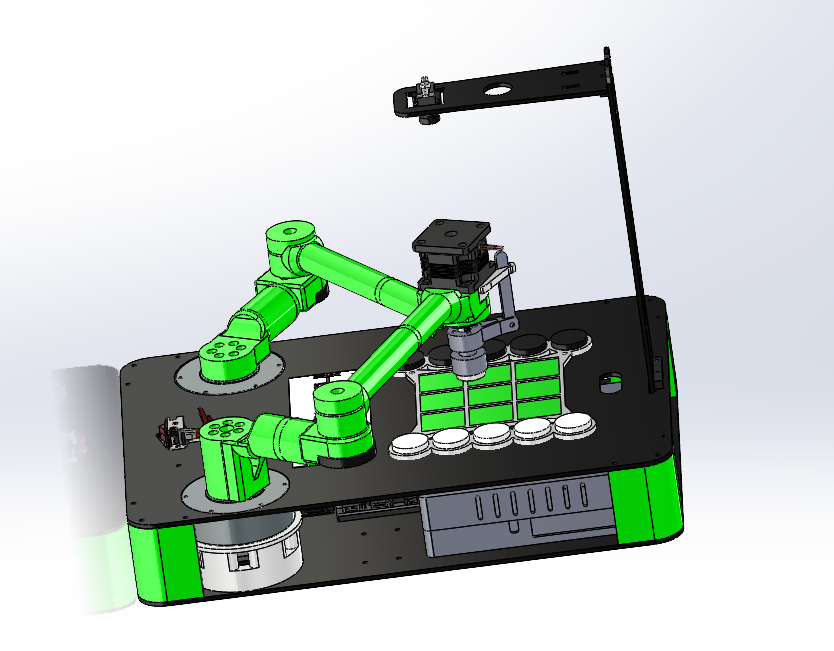
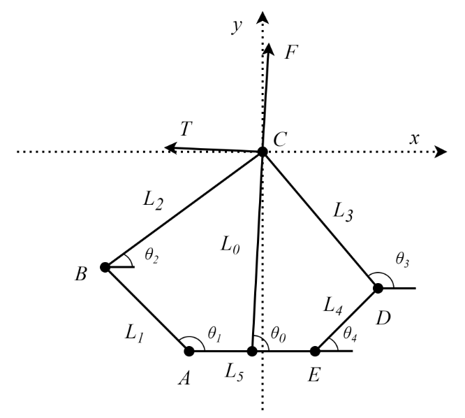
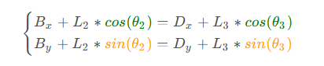
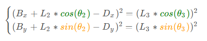
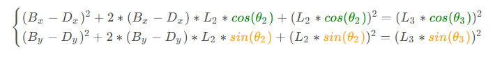
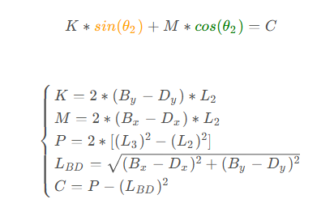
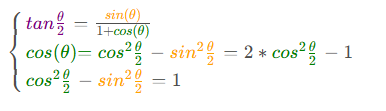
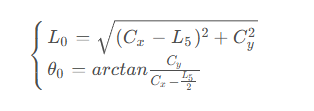
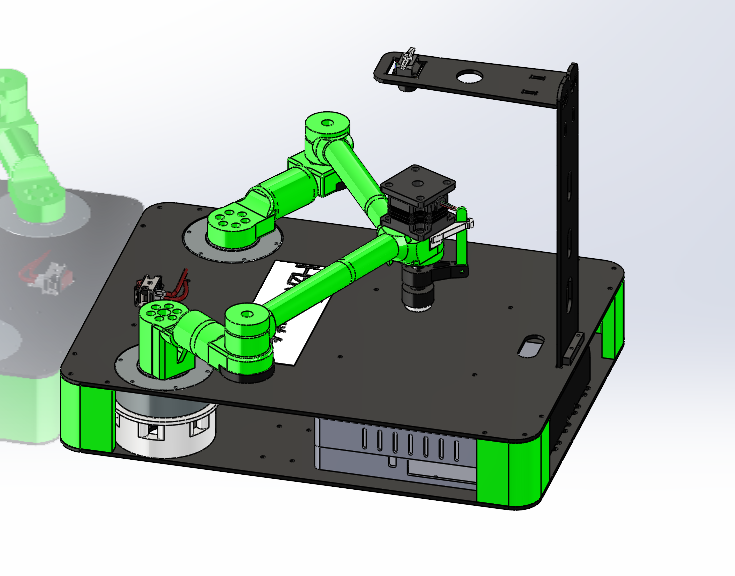

# 具身智能（并联Scara机械臂的智能应用）
#### [github:https://github.com/Lengxiaom0/SCARA](https://github.com/Lengxiaom0/SCARA/tree/master)
## 概述 
- ### 具身智能是指依靠物理实体通过与环境交互来实现智能增长的智能系统。目前，其形式包括智能机器人、自动驾驶等。2024年5月，ICRA 2024的最佳论文奖授予Open X-Embodiment，展示了机器人学习数据集和基于此训练的模型RT-X。
- ### 我们本次是基于Scara并联机械臂的智能应用，并联机械臂在平面内相较于其他机械臂更具备稳定性，并且移动更加平稳，适合于二维平面的移动，加之图像理解等多模态大模型即可具备智能交互等操作。


## Demo展示：


## 控制板块

### 控制系统设计

- **描述**:我们采用的是脉塔电机x6系列的高精度电机，每一圈分为36000个刻度，可以达到高精度的控制。整体采用can驱动，UART通信，步进电机+丝杠构成末端装置
- 因为采用的是五连杆结构，因此我们要对五连杆结构进行运动学逆解 

- 公式拆分以及代码实现：

**如图所示** 



- 其中A，E为机器人腿部控制的两个电机，θ1,θ4可以通过电机的编码器测得。五连杆控制任务主要关注机构末端C点位置，其位置用直角坐标表示为(Cx,Cy)，极坐标系用(L0,θ0)表示。




对公式(1)移项，并在等式两边进行平方有：

 

将平方展开有：

 

对公式(3)内部两个等式相加并移项有： 

 

使用二倍角法对公式(4)进一步化简，已知： 

 

推导得到极坐标为：

 

- 示例代码（C语言）
```
void Kinematics(float postion_x,float postion_y)
{
	
	float alpha1,alpha2,beta1,beta2;
	uint16_t servoLeftfront,servoLeftRear,servoRightfront,servoRightRear;
	
	float a=2*postion_x*L1;
	float b=2*postion_y*L1;
	float c=postion_x*postion_x + postion_y*postion_y + L1*L1 -L2*L2;
	float d=2 * L4 * (postion_x - L5);
	float e=2 * L4 *  postion_y;
	float f=((postion_x-L5)*(postion_x-L5)+postion_y*postion_y+L4*L4-L3*L3);
	
	alpha1=2*atan((b+sqrt(a*a+b*b-c*c))/(a+c));
	alpha2=2*atan((b-sqrt(a*a+b*b-c*c))/(a+c));
	beta1=2*atan((e+sqrt(d*d+e*e-f*f))/(d+f));
	beta2=2*atan((e-sqrt(d*d+e*e-f*f))/(d+f));

	alpha1=(alpha1>=0)?alpha1:(alpha1+2*PI);
	alpha2=(alpha2>=0)?alpha2:(alpha2+2*PI);

	beta1=(beta1>=0)?beta1:(beta1+2*PI);
	beta2=(beta2>=0)?beta2:(beta2+2*PI);

if (postion_y>0)
{
	temp_left_a=alpha1;
	temp_right_b=beta2;
}

else
{
	temp_left_a=alpha2;
	temp_right_b=beta1;
}
}
```

## 智能交互板块设计 
- **描述**：我们采用多个模型进行串联架构，综合图像理解，文本理解，语音识别等综合起来进而得到的结果，与下位机进行交互。

- ### 具体实现流程： 
- 1. 在得到下位机传送的运行指令后，首先打开摄像头进行外界信息的读取，然后进行多模态模型（本模型采用华为闭源模型）的推理，并保存。
- 2. 然后进行语音识别，与机器进行对话下达指令，识别到的文本将会放入到LLM进行推理，并进行指令拆分，得到的指令经过微调，system以及prompt的固化从而输出坐标，做到具身智能的效果。

#### 本项目借鉴于  《Do AsICan, Not As I Say:Grounding Language in Robotic Affordances》


## 机械板块

### 机械结构设计
（下附solidworks机械结构设计图链接）

- **描述**：并联机械臂是一种多连杆机械臂系统，由多个机械臂自由度联结而成，其关节可以分别控制，可实现复杂的运动轨迹，具有高度的灵活性和精度。
- **图片**：

  *图：机械结构示意图*

---


